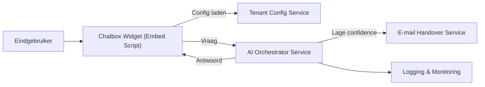
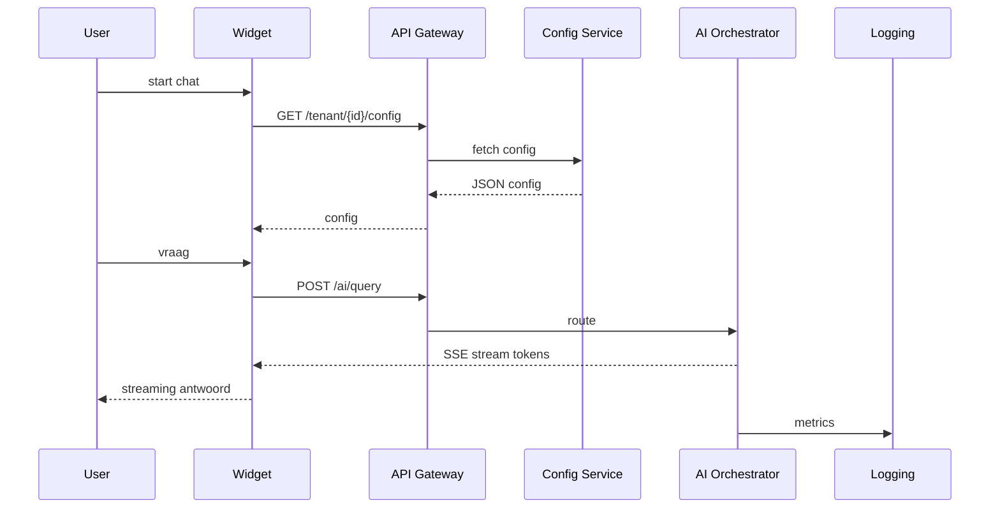
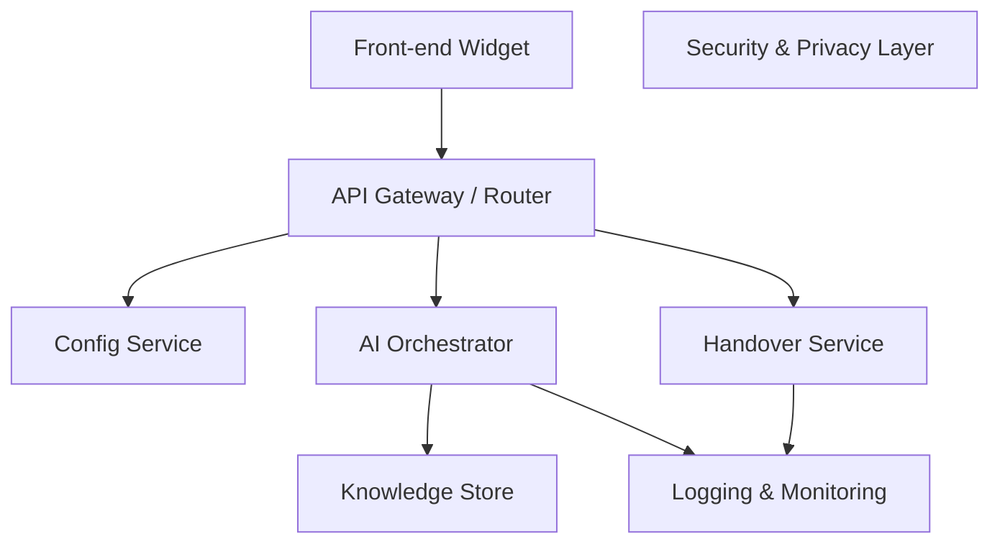

# ADA — Architectural Design & Decisions

---

## 1. Executive Summary

Veel MKB’s lopen kansen mis doordat klanten geen direct antwoord krijgen. De oplossing is een **AI-chatbox** die altijd beschikbaar is, in het **Nederlands** communiceert en bij lage confidence kan escaleren naar een **menselijke handover via e-mail**. Integratie gebeurt via een **lichtgewicht embed-script** dat op elke site kan worden geplaatst.

De architectuur is **multi-tenant**, **GDPR-compliant** en **onderhoudsarm**. Belangrijkste kwaliteitsattributen: **snelheid** (≤3s), **veiligheid** (encryptie, headers, rate-limits), **privacy** (geen chatlogs), **toegankelijkheid** (WCAG 2.1 AA), **schaalbaarheid** (multi-tenant), en **betrouwbaarheid** (rollback ≤30min).

Deze keuzes passen bij MKB’s: eenvoudig te integreren, veilig, en zonder technisch beheer door de klant.

---

## 2. Doelen, Scope & Randvoorwaarden

**Doelen**

- AI beantwoordt ≥60% van de gesprekken zelfstandig.
- Handover via e-mail bij complexe vragen.
- Plug-and-play integratie via script.
- Centraal beheer van branding en kennisbasis.
- Volledig GDPR-conform.

**Scope**

- Widget-script.
- Nederlands.
- Handover via e-mail.
- Logging en monitoring.

**Non-goals**

- Meertaligheid.
- Rapportages/statistieken.
- WhatsApp/Slack integraties.
- Voice-interface.

**Randvoorwaarden**

- Latency ≤3s.
- Uptime ≥99,5%.
- Multi-tenant isolatie.
- Onderhoudsarme updates.

---

## 3. Kwaliteitsattributen & Impact

- **Performance:** bundel ≤80kB, AI-response P95 ≤3s.
- **Security:** HTTPS-only, CSP, SRI, inputvalidatie, dependency scans.
- **Privacy:** geen opslag chatinhoud, retentie mails ≤180d, logs ≤30d.
- **Reliability:** rollback ≤30min, health checks.
- **Scalability:** multi-tenant met isolatie en rate limits.
- **Accessibility:** WCAG 2.1 AA.
- **Mobile:** FAB → drawer → fullscreen.
- **Compatibility:** laatste 2 major browsers + iOS/Android webview.

---

## 4. Architectuuroverzicht

### Contextdiagram



### Hoofdscenario’s

- **Happy path:** vraag → AI → antwoord ≤3s.
- **Fallback:** confidence laag → e-mail handover.
- **Degraded:** AI-fout → widget toont FAQ.

### Sequence (Happy Path, SSE)



---

## 5. Logische Architectuur & Componenten

### Componentdiagram



**Frontend (Widget)**

- Web Component + Shadow DOM.
- Init via `window.Chatbox.init({ tenantId })`.
- SSE-streaming, bundel ≤80kB.
- FAB → Drawer → Fullscreen (mobile).

**Backend Services**

- **API Gateway:** routing, auth, rate-limits, schema-validatie.
- **Config Service:** tenantconfig + branding/knowledge.
- **AI Orchestrator:** query → LLM → SSE output. Confidence-checks.
- **Knowledge Store:** gestructureerde Q/A, versiebeheer.
- **Handover Service:** queued e-mail + retry.
- **Logging:** events/metrics + Prometheus.
- **Security Layer:** PII-masking, CSP, inputvalidatie.

---

## 6. Gegevens & Configuratie

- **Config API:** `GET /tenant/{id}/config`, cachebaar met ETag.
- **Knowledge items:** JSON-schema (vraag, antwoord, tags, version).
- **Handover API:** `POST /handover` met email, transcript, consent.
- **Retentie:** chats niet opgeslagen; mails ≤180 dagen; logs ≤30 dagen.

---

## 7. Integratie & Interfaces

### API-contracten

**Config**

```json
GET /tenant/{tenantId}/config
{
  "tenantId":"acme",
  "branding":{"primary":"#0A84FF"},
  "welcome":"Welkom!",
  "knowledgeVersion":"2025-08-30T10:15:00Z"
}

```

**AI Query (SSE)**

```json
POST /ai/query
{ "tenantId":"acme","conversationId":"c-123","content":"Hallo" }

```

SSE: tokens + meta (confidence, latency).

**Handover**

```json
POST /handover
{
 "tenantId":"acme",
 "conversationId":"c-123",
 "userEmail":"klant@example.com",
 "transcript":[{"role":"user","content":"..."},{"role":"ai","content":"..."}],
 "consent":true
}

```

**Events (browser)**

```tsx
window.Chatbox.on("message",(e)=>{});
window.Chatbox.on("handover",(e)=>{});
window.Chatbox.on("error",(e)=>{});

```

---

## 8. Beveiliging & Privacy

- HTTPS-only, HSTS, CSP, SRI.
- Inputsanitisatie (AJV/DOMPurify).
- AuthZ per tenant-token (geen secrets in widget).
- Rate-limiting: 5 berichten/10s/IP → captcha.
- PII-masking: email/tel/IBAN.
- Consent expliciet bij handover.

---

## 9. Observability

- Uniform logschema met `tenantId`, `conversationId`, `event`, `latencyMs`.
- Metrics:
    - `ai_latency_ms_p50/p95`
    - `handover_success_rate`
    - `widget_bundle_kb`
    - `error_rate`
- Dashboards/alerts (Prometheus/Grafana).

---

## 10. Deployment, CI/CD & Rollback

- Services in containers (Docker/K8s).
- Immutability: SemVer + CDN path `/widget/vX.Y.Z/`.
- Blue/green of canary deploy; rollback ≤30 min.
- Health-checks: `/healthz`, `/readyz`.

**CI-gates**

- SBOM check (0 criticals).
- k6 smoke test: P95 ≤3s bij 20 VU.
- axe-core test: 0 critical A11y violations.
- Bundlegrootte-check widget <80kB.

---

## 11. Risico’s & Trade-offs

**Risico’s**

- AI geeft fout advies → fallback naar handover/FAQ.
- GDPR-risico’s → strikte dataminimalisatie.
- Performance issues → rate-limits.
- Mobile UX → brede testmatrix.

**Trade-offs**

- Centrale controle vs klantflexibiliteit → gekozen voor centrale controle.
- Latency vs kosten → gekozen voor performance.

---

## 12. Alternatieven overwogen

- Volledig klantbeheer kennisbasis → te complex.
- WhatsApp/Slack integratie → buiten scope.
- Opslag volledige chats → privacyrisico.

---